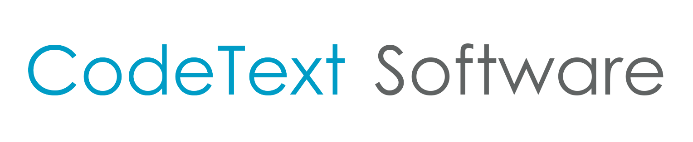
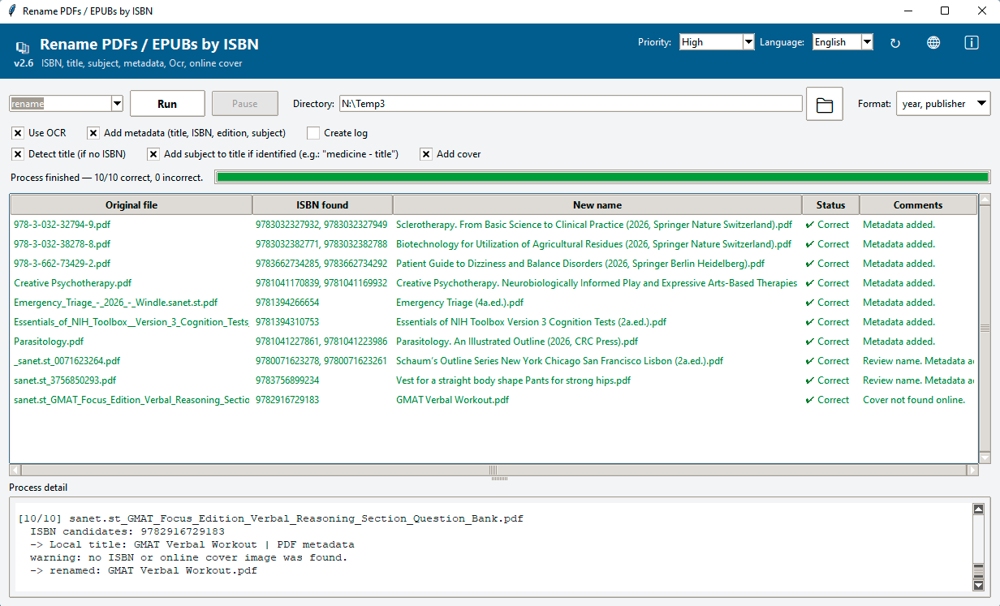
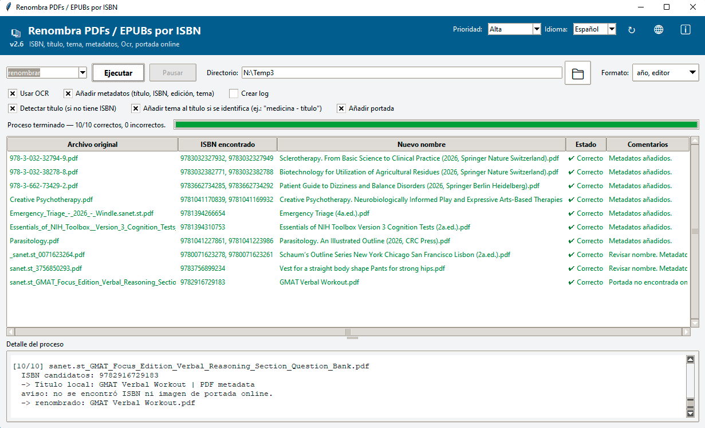

  

<h1 align="center">RenamePdfs_isbn</h1>

  Rename your PDF and EPUB e-books by ISBN — title, publisher, subject, metadata, OCR and online cover, all in one click. 
  <em>Renombra tus PDFs y EPUBs automáticamente por ISBN — título, editor, tema, metadatos, OCR y portada online, en un solo clic.</em>

  

---

## English. About CodeText Software

**CodeText** is based in Barcelona (Spain) and develops software using the latest desktop and web technologies. Our work focuses on computational semantics, creating intelligent systems to search, extract, edit, organize, and encode information in various languages. Our product  **Books Explorer** is an intelligent semantic search engine available for desktop and web that can connect to various locations hosting book repositories. We are seeking companies and institutions interested in implementing these products.

---

## Spanish. Sobre CodeText Software

**CodeText** tiene su sede en Barcelona (España) y desarrolla software utilizando las últimas tecnologías de escritorio y web. Nuestra labor se centra en la semántica computacional, creando sistemas inteligentes para buscar, extraer, editar, organizar y codificar información en diversos idiomas. Nuestro producto **Books Explorer** es un motor de búsqueda semántica inteligente disponible para escritorio y web, capaz de conectarse a diferentes ubicaciones donde se alojan repositorios de libros. Buscamos empresas e instituciones interesadas en implementar estos productos.

**Contact:** [CodeText@yahoo.com](mailto:CodeText@yahoo.com)  
**Website (English):** [https://www.codetext.org?Idioma=_Eng](https://www.codetext.org?Idioma=_Eng)  
**Website (Español):** [https://www.codetext.org](https://www.codetext.org) 
**Facebook:**          [https://www.facebook.com/CodeTextSoftware](https://www.facebook.com/CodeTextSoftware)  

---

## English RenamePdfs_isbn Information.

**RenamePdfs_isbn** is a free Windows tool that automatically renames PDF and EPUB files according to their ISBN. It detects the ISBN from the text, metadata, or via OCR when the file has no extractable text, searches online for the real title, publisher, edition and subject, and renames the file accordingly. It also saves the retrieved information in the file metadata and tries to add an online cover as the first page when the file does not have one.

### Features

- **PDF and ePub support**: process all files in a folder or only the files selected by the user.
- **OCR support** for text or image-only PDFs with Tesseract OCR (64-bit).
- **ISBN10 to 13 detection** in the text, metadata, or via OCR when the file has no extractable text.
- **Online lookup** of title, edition, year, publisher and subject using systems such as Google Books, Open Library and CrossRef/DOI.
- **Smart alternatives**: title recovered from PDF/EPUB metadata, content heuristics, or a filename-based search. Renaming is skipped only when there is no reliable text, avoiding the risk of an incorrect title.
- **Configurable naming format**: add the book's year, edition and publisher in parentheses.
- **Cover insertion**: when the file has no cover, the program tries to obtain an image online and inserts it as the first page.
- **Metadata writing**: retrieved metadata is saved in the file.
- **Three execution modes**: *simulate* (performs the complete process without applying changes), *rename*, or *run without renaming* (applies metadata and inserts the cover, but does not rename the file).
- **Adjustable process priority**.
- **Customizable design** using multiple themes and manually by editing `config.xml`.
- **Optional process log** with details in `.txt` format and, additionally, a `.csv` report with comma-separated fields and one file per line.

### Requirements

- Windows 10/11, 64-bit.
- An internet connection for online lookups.
- Supported languages: English and Spanish.

> **Tesseract OCR is already bundled with the installer**, so you don't need to install it separately. When installing it, you can select additional languages besides English using the **“Additional language data”** option.

### Installation

1. Download [`RenamePdfs_isbn.zip`](download/RenamePdfs_isbn.zip) (or use the update icon "↻" inside the app, which points to the same file).
2. Unzip it anywhere and run the installer — it includes Tesseract OCR (64-bit), so there's nothing else to install.
3. Run `RenamePdfs_isbn.exe`.

### Usage

1. Pick the folder (or individual files) to process with the 📁 button.
2. Choose a run mode (*simulate*, *rename*, *run without renaming*), the naming format (year/publisher), and the desired options (OCR, metadata, subject, cover, log).
3. Click **Run**. You can **Pause** or **Cancel** at any point.
4. Review the results in the grid: ISBN found, new name, status and comments. A `.csv` report and/or `.txt` log can be saved automatically.

### Configuration (`config.xml`)

`config.xml` is created automatically next to the executable on first run, and stores:

- Window size, column widths and log panel height.
- Last used folder and file filter.
- Interface language (`<languaje value="en"/>` or `"es"`, English by default).
- Preferred process priority (`<priority value="highest"/>`, etc.).
- All interface colors (`<colores .../>`): panel background, field background, selection color, grid scrollbars, button colors, general text color, and the "Process detail" panel's background/text/selection colors.

You can edit these values by hand (with the app closed); they're applied the next time it starts.

---

## Español RenamePdfs_isbn Información.

**RenamePdfs_isbn** es una herramienta gratuita para Windows que renombra automáticamente archivos PDF y EPUB según su ISBN. Detecta el ISBN por texto, metadatos o mediante OCR cuando el archivo no tiene texto extraíble, busca online el título real, editor, edición y tema, y renombra el archivo en consecuencia. También guarda la información recuperada en los metadatos del archivo e intenta añadir una portada online como primera página cuando no la tiene.

  

### Características

- **Detección de ISBN** por texto embebido, metadatos del PDF/EPUB, o mediante OCR (con Tesseract) cuando el archivo no tiene texto extraíble.
- **Búsqueda online** de título, editor/año y tema (Google Books, Open Library, CrossRef/DOI, entre otros).
- **Alternativas inteligentes**: título local desde metadatos del PDF/EPUB, heurística de contenido, o búsqueda por nombre de archivo — solo se omite el renombrado cuando no hay nada fiable, en vez de arriesgar un título erróneo.
- **Formato de nombre configurable**: añadir el año, el editor, ambos o ninguno.
- **Inserción de portada**: obtiene una imagen de portada online y la inserta como página 1 cuando el archivo no tiene ya una.
- **Escritura de metadatos**: título, ISBN, edición y tema pueden escribirse en los metadatos propios del PDF.
- **Tres modos de ejecución**: *simular* (solo previsualiza), *renombrar*, o *ejecutar sin renombrar* (aplica metadatos/portada pero conserva el nombre).
- **Soporte OCR** para PDFs escaneados/solo imagen, con Tesseract OCR (64 bits) incluido en el instalador — nada más que configurar.
- **Interfaz bilingüe** (Español / English), cambiable en cualquier momento desde la cabecera — todos los textos, mensajes y el log siguen el idioma elegido.
- **Prioridad de proceso ajustable** (Tiempo Real / Alta / Normal / Baja), comprobada contra lo que Windows aplica realmente, no solo lo pedido.
- **Diseño personalizable** mediante múltiples temas y manualmente editando `config.xml`.
- **Archivo de log opcional** con los detalles del procesamiento en formato `.txt` y, además, un informe `.csv` con campos separados por comas y un archivo en cada línea.

### Requisitos

- Windows 10/11, de 64 bits.
- Conexión a internet para las búsquedas online.
- Idiomas soportados: Español e Inglés.

> **Tesseract OCR ya viene incluido en el instalador**, por lo que no hace falta instalarlo aparte. Al instalarlo, puedes seleccionar lenguajes adicionales además del inglés mediante la opción **"Additional language data"**.

### Instalación

1. Descarga [`RenamePdfs_isbn.zip`](download/RenamePdfs_isbn.zip) (o usa el icono de actualizar ↻ dentro de la app, que apunta al mismo archivo).
2. Descomprímelo donde quieras y ejecuta el instalador — incluye Tesseract OCR (64 bits), así que no hay nada más que instalar.
3. Ejecuta `RenamePdfs_isbn.exe`.

### Uso

1. Elige la carpeta (o archivos concretos) a procesar con el botón 📁.
2. Elige el modo de ejecución (*simular*, *renombrar*, *ejecutar sin renombrar*), el formato de nombre (año/editor) y las opciones deseadas (OCR, metadatos, tema, portada, log).
3. Pulsa **Ejecutar**. Puedes **Pausar** o **Cancelar** en cualquier momento.
4. Revisa los resultados en la tabla: ISBN encontrado, nuevo nombre, estado y comentarios. Se puede guardar automáticamente un reporte `.csv` y/o un log `.txt`.

### Configuración (`config.xml`)

`config.xml` se crea automáticamente junto al ejecutable en el primer arranque, y guarda:

- Tamaño de ventana, ancho de columnas y alto del panel de log.
- Última carpeta y filtro de archivos usados.
- Idioma de la interfaz (`<languaje value="en"/>` o `"es"`, inglés por defecto).
- Prioridad de proceso preferida (`<priority value="highest"/>`, etc.).
- Todos los colores de la interfaz (`<colores .../>`): fondo del panel, fondo de campos, color de selección, barras del grid, colores de botones, color de texto general, y fondo/texto/selección del panel "Detalle del proceso".

Estos valores se pueden editar a mano (con la app cerrada); se aplican en el siguiente arranque.

---

  © 2026 <a href="https://www.codetext.org">CodeText Software</a>. All rights reserved. / Todos los derechos reservados.

